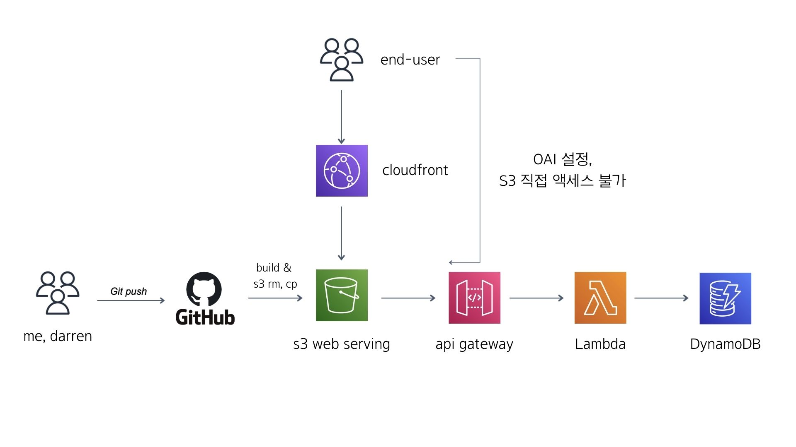

# cinepass admin

## 기말 과제로 같은 아키텍쳐를 사용하되, 완전 다른 프로젝트로 재구성예정

## why make this? (deprecated)

~~독립영화극장 후원을 목적으로 한 기획 행사에서 극장 캐셔분들이 사용할 웹 페이지를 작성했습니다.  
결제가 이루어지는 시점마다 작동하기 위해 AWS Lambda를 이용하여 serverless로 구축하였으며  
S3와 CloudFront로 서빙하였습니다. 원본 오리진에는 직접 액세스를 할 수 없도록 OAI를 사용하였습니다.~~

## arch 

- aws lambda (serverless) + api Gateway + DynamoDB + CloudWatch
- S3 정적 웹 사이트 호스팅 + CloudFront
- CloudFront의 OAI(Origin Access Identity)를 통해 S3 오리진 직접 액세스를 금지시켰습니다.
- typescript
- github action => s3 버킷 내용 초기화 및 빌드 파일 s3 업로드로 간단한 CD(Continuous Deployment)를 구현했습니다.
